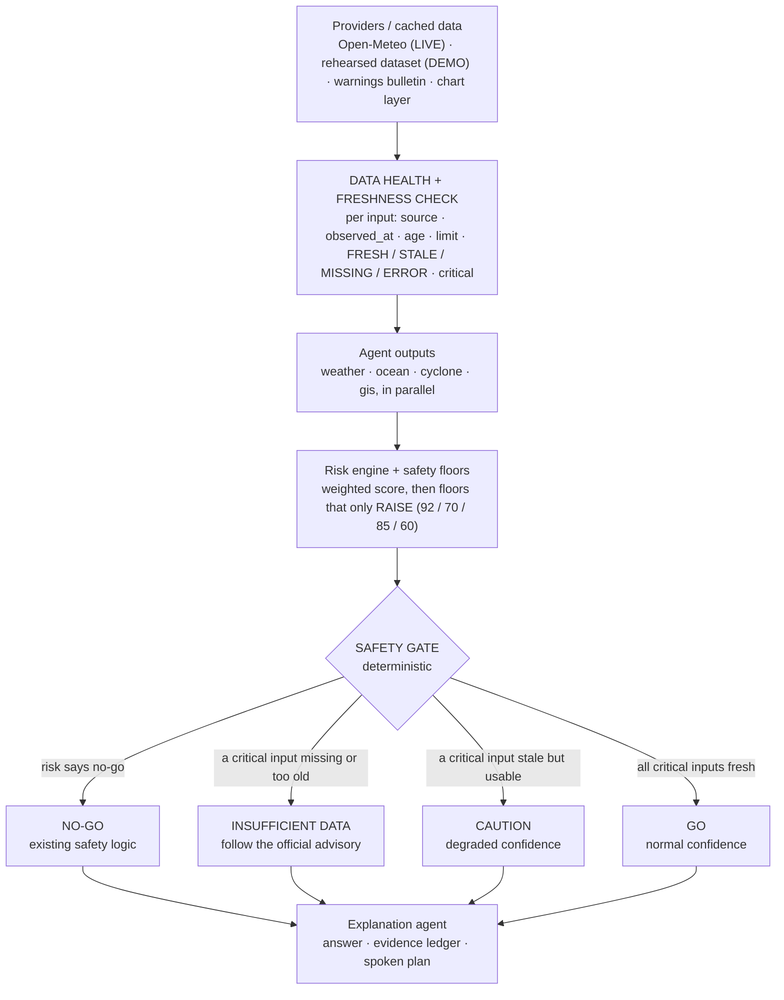
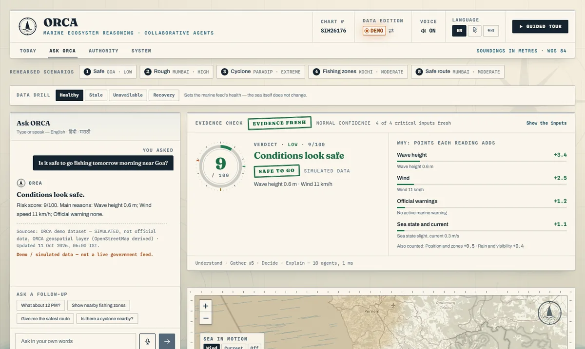
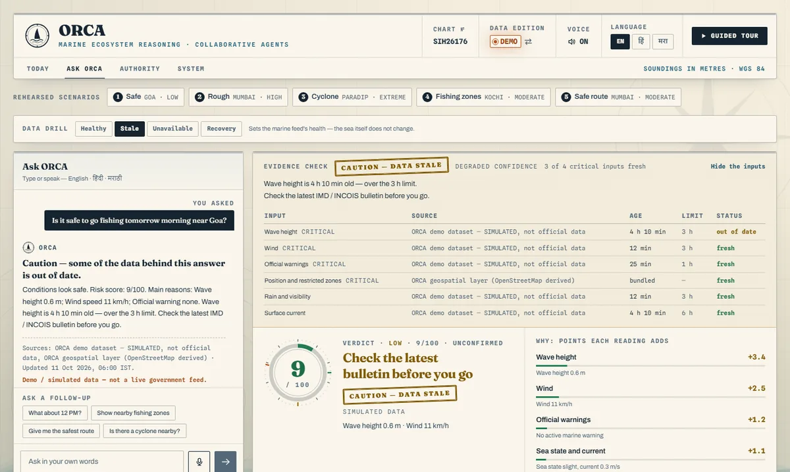
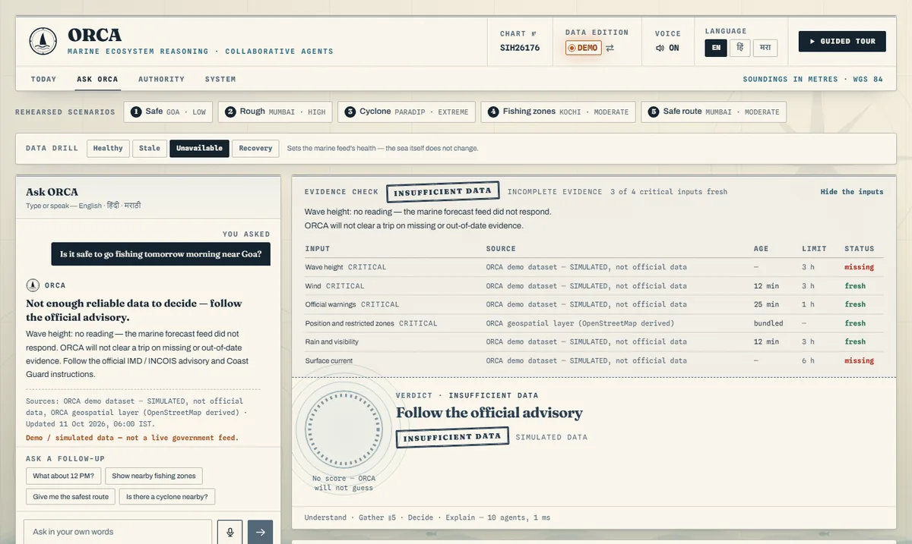
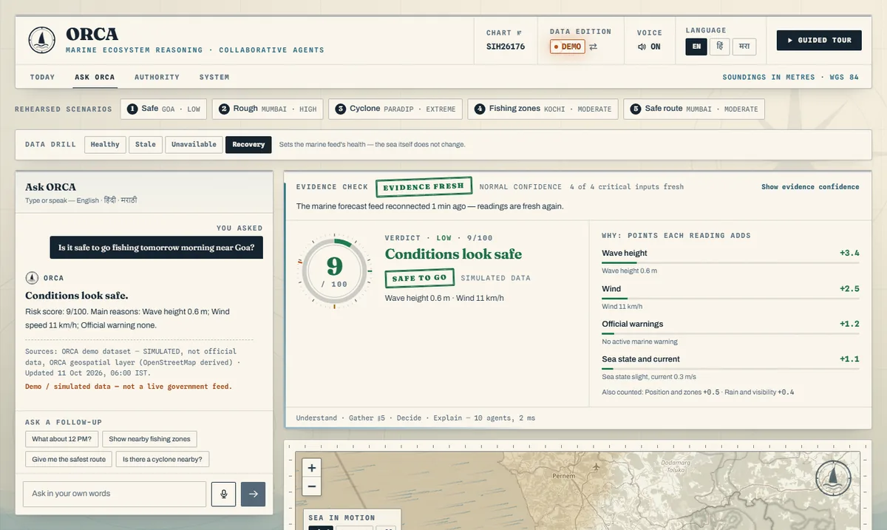
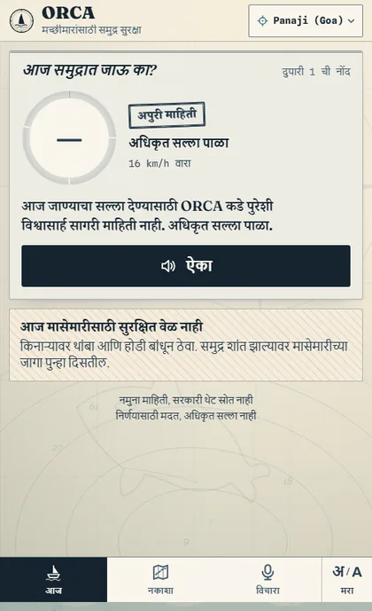
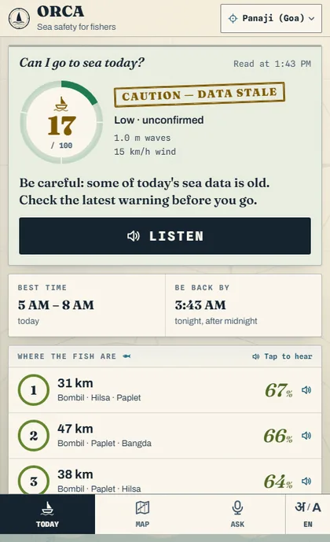
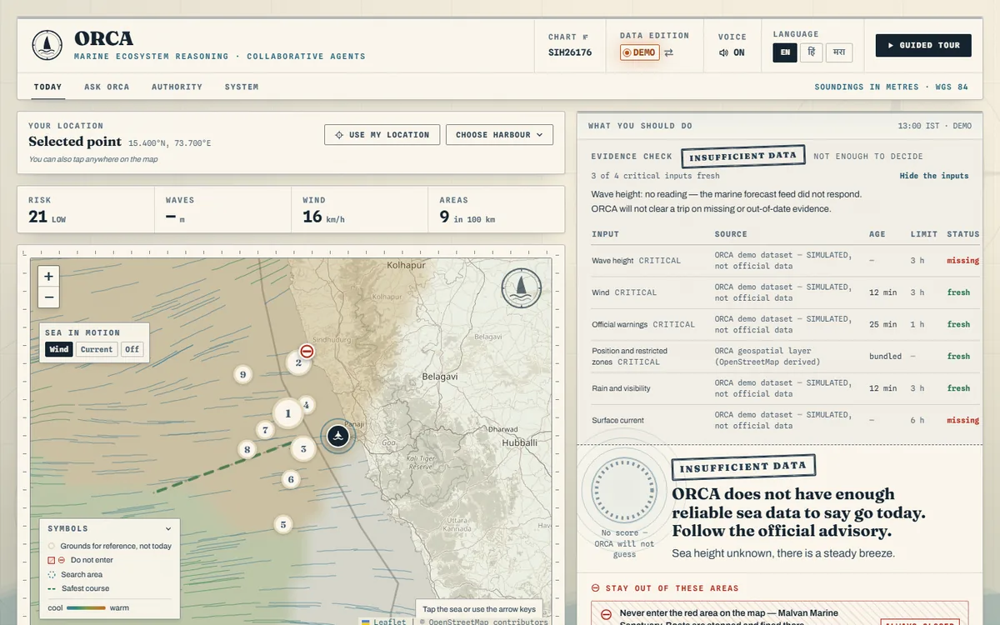

# Know when NOT to decide: the data-sufficiency safety gate

*Vibeathon 2026 mentor challenge for ORCA (SIH26176). Built, tested and wired into every surface in one session on 10 Oct 2026.*

> **ORCA already knew when the sea was dangerous. Now it also knows when it doesn't know.**

Before this change, ORCA treated a four-hour-old wave forecast exactly like a fresh one. A silent marine feed was papered over with an assumed value. Now every input of the go/no-go decision carries a **data-health record**: source, when it was observed, age, freshness limit, status, and whether it is critical. A small **deterministic safety gate** runs after the risk engine and its floors, and before the answer. It chooses one of four states:

| State | When | What the fisher is told |
|---|---|---|
| **GO**, normal confidence | every critical input is fresh and the existing verdict is go | the existing verdict, unchanged |
| **CAUTION**, degraded confidence | a critical input is stale but still usable | the verdict, marked *unconfirmed*, plus "check the latest bulletin before you go" |
| **INSUFFICIENT DATA** | a critical input is missing, failed, too old or never reported | **no score**, no trip plan, "follow the official advisory" |
| **NO-GO** | the existing safety logic already says do not go | unchanged. Missing or old data can never weaken it |

## Before and after

| | Before | After |
|---|---|---|
| Wave forecast 4 h 10 min old | "Safe to go", full confidence | **CAUTION**: *Wave height is 4 h 10 min old — over the 3 h limit.* |
| Marine feed silent | DEMO had no way to show it. LIVE swapped in demo values, and the engine assumes a 0.3 hazard for an unknown wave, so it could still say "Safe to go" | **INSUFFICIENT DATA**: no wave height is invented, no score is shown, *follow the official advisory* |
| Official warning in force | NO-GO, floor 70 / 92 | **identical**: NO-GO with the same floor, under every data condition |
| Feed comes back | n/a | **GO** again on the next question, with no restart and no code change |
| Where it shows | the verdict | the verdict stamp, the evidence-check strip, the inputs table, the evidence ledger, the answer text, the spoken phone plan |

## Where the gate sits



- **The check** is in `backend/app/services/data_health.py`. Each agent runs it where it reads its provider, and attaches a `DataHealth` record per input to its result.
- **The gate** is in `backend/app/services/safety_gate.py`. The planner calls it after the risk node (`agents/planner.py`, "node 3b"), and `/api/fishing` calls it for Today.

## What it checks

The limits for every input live in one place, `backend/app/config.py` → `DATA_HEALTH`. They are served at `GET /api/config`, and any of them can be overridden with `ORCA_FRESH_<INPUT>_S` / `ORCA_MAXAGE_<INPUT>_S`.

| Input | Feed | Critical | Fresh ≤ | Usable ≤ | Why it is critical |
|---|---|---|---|---|---|
| Wave height | marine | **yes** | 3 h | 6 h | 25 % of the score; carries the 4 m floor (85) |
| Wind | weather | **yes** | 3 h | 6 h | 20 %; carries the gale floor (85) |
| Official warnings | warnings bulletin | **yes** | 1 h | 3 h | 25 %; carries the 92 / 70 floors; a warning can be issued at any hour |
| Position & restricted zones | bundled chart layer | **yes** | static | static | carries the restricted-zone floor (60) |
| Rain & visibility | weather | no | 3 h | 6 h | supporting (10 %) |
| Surface current | marine | no | 6 h | 12 h | supporting (part of sea state) |

These are **engineering defaults, not a certified standard**: marine and weather models refresh every 1–6 h. We say so out loud, as we do for the risk weights.

How each reading is judged:

| Condition | Status |
|---|---|
| Provider did not answer | MISSING (ERROR if it returned an error) |
| No timestamp | STALE, unusable: its age cannot be shown |
| Timestamp more than 10 min in the future | ERROR |
| Age ≤ fresh limit | FRESH |
| Age ≤ usable limit | STALE, usable with caution |
| Older than that | STALE, unusable |
| LIVE reading replaced by a demo stand-in | MISSING: a stand-in never clears a trip |

## How it decides

```text
blocking = critical inputs that are missing, errored, too old, untimestamped, or never reported
stale    = critical inputs that are stale but still usable

no risk result          -> INSUFFICIENT_DATA
risk says do not go     -> NO_GO              (the existing safety law, untouched)
blocking                -> INSUFFICIENT_DATA
stale                   -> CAUTION
otherwise               -> GO
```

**Guarantees.** Every one of these is a test in `backend/tests/test_safety_gate.py`:

1. The gate reads the risk assessment and never writes it. Score, band and floors are byte-for-byte what the risk engine produced.
2. If the existing logic says no-go, the state is NO-GO under every drill. Mumbai 06:00 stays 70 HIGH and Paradip stays 92 EXTREME with the marine feed stale, down or back.
3. GO is only possible when every critical input is FRESH.
4. An input nobody reported is MISSING, never assumed fine.
5. In the "unavailable" drill the wave height is `None`. No value is invented.
6. Supporting inputs (rain, current) never gate the decision. They show in the inputs table.
7. A missing reading can lower the model's own share of a score, because the engine assumes a mid hazard (0.3) for an unknown value. It can never push a score below an official-warning floor or into a GO. Any score shown on incomplete evidence is printed **unconfirmed**. Example, Digha under an IMD warning: 80 EXTREME with fresh data. With the marine feed down it reads 70 HIGH (the warning floor), stays NO-GO, and is marked unconfirmed.
8. **Nothing plans a trip on a withheld verdict.** When a reading is missing, every surface drops the plan: no fishing grounds, no course, no best hours, no stay or catch figures, no next-day sea claims and no 24-hour score timeline. That covers desktop Ask and Today, the phone's Today and Ask cards, the spoken plan, the stat row and the Authority board.
9. **LIVE mode never invents a warning, and never claims there is none.** There is no open IMD/INCOIS feed. In LIVE mode the scripted demo bulletins are never shown, because a flat sea under a fake "IMD warning" teaches a fisher to ignore the next one. The warnings input reads **"not connected — check IMD / INCOIS"** and is never "none". It is MISSING, so a LIVE answer is INSUFFICIENT DATA, unless the live sea itself already says NO-GO (waves ≥ 4 m, a gale). The scripted "improves after 11:00" is also DEMO-only.

## It also knows when it does not know *where* or *when*

Evidence can be missing for the place or the day as well as for a feed. Neither is ever quietly substituted.

| The question | Before | Now |
|---|---|---|
| *"Can I go fishing near Malvan tomorrow?"* (no Malvan landing centre) | answered for Mumbai, silently | **INSUFFICIENT DATA**: *"ORCA does not know Malvan yet — it has no sea readings for it. Choose your harbour on the map."* No score is computed for the wrong place. |
| *"…near Goa in 5 days?"*, *"next week"*, *"५ दिवसांनी"* | answered for today, silently | **INSUFFICIENT DATA**: *"ORCA can only see 3 days ahead — you asked about 5 days from now."* |
| *"Can I go fishing tomorrow morning?"* (no place named) | Mumbai, silently | Mumbai, the default harbour, and the answer **says so**: *"No place was named — this answer is for Mumbai…"* |

The checks recognise English ("near / from / off …"), Marathi ("…जवळ") and Hindi ("… के पास"). They never mistake ordinary words for places: "near the coast", "at 6 AM" and "in Marathi" are tested.

## The four deterministic drills

The sea never changes between drills; only the rehearsed marine feed's health does. Switch drills from:
- the **Data drill** chips in the Ask view;
- a link: `/?tab=ask&drill=stale`, `/?m=1&drill=unavailable`;
- the API: `POST /api/config/data-health {"drill": "stale"}`;
- start-up: `ORCA_DATA_DRILL=stale`.

The switch takes effect on the next question, with no restart.

Every row below is the same question, *"Is it safe to go fishing tomorrow morning near Goa?"*:

| Drill | Marine feed | Gate | Score shown | First reason |
|---|---|---|---|---|
| `healthy` | delivered 18 min ago | **GO** · normal | 9 / 100 | All 4 critical inputs are fresh. |
| `stale` | delivered 4 h 10 min ago | **CAUTION** · degraded | 9 / 100 *unconfirmed* | Wave height is 4 h 10 min old — over the 3 h limit. |
| `unavailable` | did not respond | **INSUFFICIENT DATA** | *withheld* | Wave height: no reading — the marine forecast feed did not respond. |
| `recovery` | reconnected 1 min ago | **GO** · normal | 9 / 100 | The marine forecast feed reconnected 1 min ago — readings are fresh again. |

| Healthy: GO | Stale: CAUTION |
|---|---|
|  |  |
| **Unavailable: INSUFFICIENT DATA** (the inputs table opens by itself) | **Recovery: GO again** |
|  |  |

The fisher's own phone follows the same gate. Marathi on the left, English on the right:

| Phone, unavailable (मराठी) | Phone, stale |
|---|---|
|  |  |

The **Authority board** runs the same gate for every landing centre. When any centre rests on stale or missing readings, the evidence check heads the board. Each affected row is marked *Insufficient data* or *unconfirmed*, and a warned centre stays NO-GO.

With missing data, the Today console plans no trip. Its first spoken sentence is the gate's:



## Recovery in LIVE mode

With live data, freshness is measured from when each Open-Meteo series was fetched (`live_client` stamps it).

1. A failed fetch is remembered for 60 s (`CACHE_TTL_FAIL`). During that window the gate says INSUFFICIENT DATA, because the labelled stand-in values never clear a trip.
2. After 60 s the provider is retried.
3. When it answers, the sea readings are FRESH again on the next question, with no restart and no code change. The answer still withholds a go, because no official warnings feed is connected in LIVE mode (guarantee 9). A real alert feed, such as NDMA's public CAP alerts (SACHET), is the next integration.

`test_live_outage_recovers_by_itself_after_the_failure_cache_expires` proves this with a fake provider and a fake clock.

## Run it yourself

From a clean checkout:

```bash
pip install -r backend/requirements.txt -r backend/requirements-dev.txt
```

```bash
python -m pytest backend/tests/test_safety_gate.py -v
```

```bash
python -X utf8 backend/smoke_test.py
```

The smoke test now ends with a SAFETY GATE section:

```text
SAFETY GATE — data sufficiency (same sea, only the marine feed changes)
  healthy      -> GO                normal       score 9/100     All 4 critical inputs are fresh.
  stale        -> CAUTION           degraded     score 9/100     Wave height is 4 h 10 min old — over the 3 h limit.
  unavailable  -> INSUFFICIENT_DATA insufficient score withheld  Wave height: no reading — the marine forecast feed did not respond.
  recovery     -> GO                normal       score 9/100     The marine forecast feed reconnected 1 min ago — readings are fresh again.
  floor check  -> Paradip with the marine feed down: 92/100 EXTREME, gate NO_GO
ALL DEMO CHECKS PASSED
```

The four scenarios the brief asks for, as named tests:

```text
test_scenario_1_healthy_data_keeps_the_existing_verdict              PASSED
test_scenario_2_stale_marine_data_is_not_presented_as_fresh          PASSED
test_scenario_3_missing_marine_data_fails_safe_and_invents_nothing   PASSED
test_scenario_4_recovery_returns_to_normal_without_a_restart         PASSED
test_official_warning_floors_hold_under_every_drill[... x 8]         PASSED
105 passed (safety gate) · 284 passed (backend) · 754 passed (frontend)
```

Then open the app (`RUN-ORCA.bat`, or `cd backend; python -m uvicorn app.main:app --port 8000`) and try:

- `http://127.0.0.1:8000/?tab=ask&demo=safe`, then press the Data drill chips;
- `http://127.0.0.1:8000/?tab=home&at=15.40,73.70&drill=unavailable`;
- `http://127.0.0.1:8000/?m=1&drill=unavailable&lang=mr`.

When done, set the drill back to `healthy`. It is server-wide, like the LIVE/DEMO switch.

A single request can also carry its own drill, leaving the server's alone: `"drill"` in the `/api/chat` body, or `?drill=` on `/api/fishing` and `/api/authority/dashboard`. The app's chips and `?drill=` links send it with every question, so the demo behaves the same on a serverless host.

## The 2–3 minute demo

1. **Healthy.** Ask view, Goa question: 9 / 100, *Safe to go*, and the strip reads *4 of 4 critical inputs fresh*.
2. **Stale.** Same sea, same 9 / 100, but the stamp flips to **Caution — data stale**: the wave forecast is 4 h 10 min old.
3. **Unavailable.** **Insufficient data · Follow the official advisory**. The dial becomes sonar rings with no number, and the wave readout shows "—". The inputs table names the missing reading.
4. **The floor holds.** With the feed still down, ask about Paradip: still **92 EXTREME · Do not launch**.
5. **Recovery.** Back to **GO, normal confidence**, "marine feed reconnected 1 min ago". No restart.
6. **Proof.** Run `python -m pytest backend/tests/test_safety_gate.py -v`.

## Design decisions to defend

- **Stale is CAUTION, too old is INSUFFICIENT.** A forecast a little past one model cycle still describes the sea, but not confidently. One more than two cycles old (6 h for waves) is treated as missing.
- **No score when data is missing.** For an unknown wave the risk engine assumes a 0.3 hazard. That is an assumption, not a reading, so ORCA prints no number it cannot stand behind.
- **NO-GO dominates.** Bad data can only push ORCA's *decision* toward caution. An old reading that says *danger* is still honoured. A missing one cannot lift a warning, and the score it leaves behind is marked unconfirmed.
- **Only critical inputs gate.** Rain and current are supporting: missing them lowers what the inputs table shows, not the verdict. All four critical inputs carry a safety floor.
- **The drill is runtime state, like LIVE/DEMO.** It needs no restart, and the next question sees it. It is deterministic because ages are relative to the clock and the tests freeze the clock.
- **Out of scope, on purpose:** no UI redesign, no risk-engine rewrite, no LLM, no new languages, no IMD/INCOIS/MOSDAC integration.

## Files

| Area | Files |
|---|---|
| Thresholds | `backend/app/config.py` (`DATA_HEALTH`) |
| Provider state and drills | `backend/app/data/feeds.py`; `live_client.py` stamps fetch times |
| Check and gate | `backend/app/services/data_health.py`, `backend/app/services/safety_gate.py` |
| Contracts | `backend/app/schemas.py` (`DataHealth`, `SafetyDecision`) |
| Agents | `ocean_agent.py`, `weather_agent.py`, `cyclone_agent.py`, `gis_agent.py` report their inputs' health |
| Decision and words | `planner.py` (gate node), `explanation_agent.py` (answer and evidence), `plain_language.py`, `api/fishing.py`, `api/routes.py` (`/api/config/data-health`) |
| Words, en/hi/mr | `backend/app/services/i18n.py` (`dh_*`, `gate_*`), `frontend/src/i18n/gate.ts` |
| UI | `frontend/src/components/SafetyGate.tsx` (evidence check and inputs table), `DataDrill.tsx`, `RiskCard.tsx`, `FishingPanel.tsx`, `MobileApp.tsx`, `gateModel.ts`, `boot.ts` (`?drill=`) |
| Tests | `backend/tests/test_safety_gate.py` (74), `frontend/src/components/SafetyGate.test.tsx`, `DataDrill.test.tsx`, `RiskCard.test.tsx`, `FishingPanel.test.tsx`, `MobileApp.test.tsx`, `gateModel.test.ts`, `boot.test.ts` |
